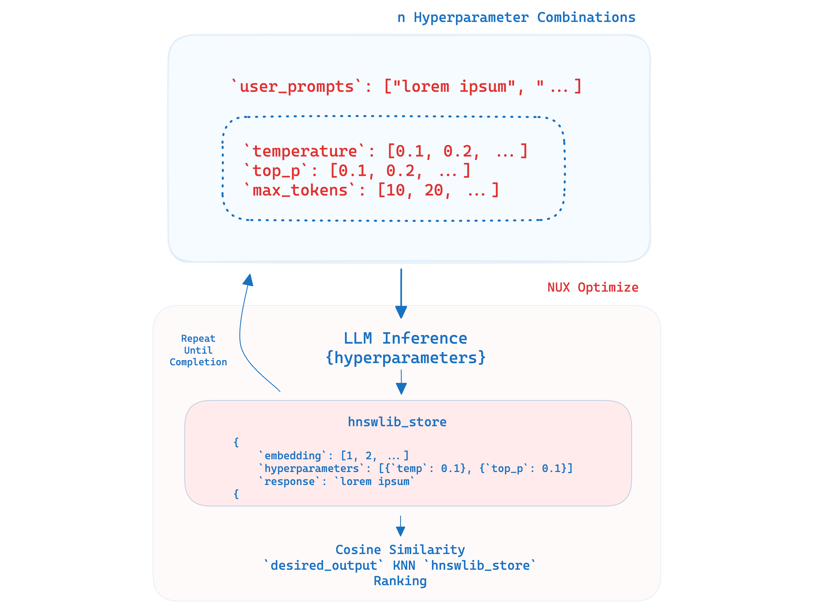

# NUX Optimize

NUX Optimize is an open-source tool for automating the fine-tuning of hyperparameters in Large Language Models (LLMs).

## Why Optimize?

When using LLMs (like GPT4), developers are forced to experiment with seemingly unlimited combinations of `temperature` values, `system prompts`, `top_p` and more. These values can all produce wildly different outputs from the model. 

These then yield hundreds of **versions** of different hyperparameter combinations, not even mentioning changing the actual `user_prompt`.

`Hyperparameter optimization` offers a simple way to pursue objective evaluation of how each combination of hyperparameter compares to the desired output.

## How Does it Work?



#### First setup your environment

```pip install requirements.txt```

### 1. Provide a single, or series of user_prompts as tasks for the LLM: 
```python
user_prompts = [
    "generate a summary from this article: {{article}}", 
    "take a deep breath and generate a summary from this article: {{article}}..."
]
```

### 2. Provide a desired output:
```python
desired_output = "This article does xyz..."
```

### 3. Feed this into the optimize tool 
```python
nux = NuxAI(model="chatgpt", api_key="***")

results = nux.optimize(
    max_combinations=100, 
    user_prompts=user_prompts, 
    desired_output=desired_output
)
```

- `api_key`: Your OpenAI api key
- `max_combinations`: This is the separation between each hyperparameter, for example an interval of `0.1` will generate `temperature` combinations of `0.1, 0.2, ...`. The lower the number, the more possible combinations which creates more API calls to GPT.
- `user_prompt`: The various instructions as tasks provided to the model. Each of these will generate an entirely different set of hyperparameter settings, as such it is logarithmically expensive. 
- `desired_output`: Think of this like a [Goal Seek](https://blog.hubspot.com/marketing/goal-seek-excel#:~:text=What%20is%20the%20Goal%20Seek,to%20match%20your%20specified%20result.) formula. You are providing a goal and it works backwards from it

### 4. Combinations are generated, and responses are stored locally

The script will call the LLM's inference service, and save each combination of hyperparam/user_prompt pairs against its' response in a local `results.json` file.

### 5. Embeddings generated

Each response will be converted into an embedding and stored in a local `HNSW` vector store where a cosine similarity against the `desired_output` will be calculated. 

### 6. Response similarity calculated against desired_output and report generated

An HTML page like [index.html](index.html) will be generated, which contains a ranking of each `user_prompt` and `hyperparameter` combination. Rankings are determined based on similarity scores from the local embedding store's KNN response. 

## What are some other examples?

## FAQs

### I want to use this inside my company

### Support for other models?

### More features?

### I need help setting it up

### Other questions

[me@ethan.dev](mailto:me@ethan.dev)